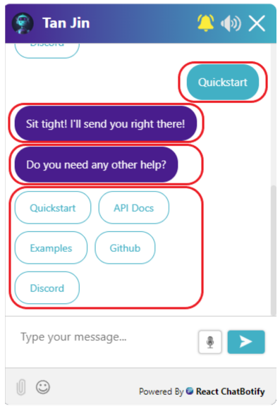

# Conversations

Conversations refer to the interactions between the bot and the user. Here's how a basic conversation may look like:

```jsx
const flow = {
  start: {
    message: "What is your age?",
    path: "end"
  },
  end: {
    message: (params) => `I see you are ${params.userInput}!`,
    chatDisabled: true
  }
}
```

In a conversation, there are 4 important properties to take note of and they are the **Flow** (conversation flow), **Block** (conversation block), **Attributes** and **Params**. Below,
we observe how these properties interact with each other:


1. Upon initializing the chatbot, the chatbot **immediately pre-processes** the `start` block within a conversation flow (represented by the unique yellow box above).
Following which, it patiently waits for a user input.
2. When a user sends a message (or uploads a file), the **current block** is retrieved and **post-processing** is done for it. If a next path is found during **post-processing**,
then **pre-processing** of the **next block** is also done. Notice that **both pre-processing and post-processing** of a block involves accessing
attributes (e.g. `messages` and `path`). For dynamic attributes, params (e.g. `userInput`) are also involved.
3. Once the **pre-processing** of the new block (if applicable) is done, the chatbot again waits for the next user input.

In short, each user input triggers post-processing of a current block and pre-processing of the next block (if applicable)! In between the pre-processing and post-processing of the
block is where the chatbot waits for the user input. Now that you have a high level idea of a conversation structure, let us quickly take a look at the details for individual properties.

## Flow

Passed in the `flow` prop of the `ChatBot`, it can contain any number of blocks to build up an entire conversation. it is **compulsory** that a flow has minimally the `start` block which is
the **default entry point** to a conversation.

Apart from the `start` block, there are no rules for the naming of other blocks although it is advisable to name your block clearly after its use (e.g. `end` block for the final block
in your conversation). In the code snippet shown below, the flow contains 2 blocks - the `start` and `end` block:

```jsx
const flow = {
  start: {
    message: "What is your age?",
    path: "end"
  },
  end: {
    message: (params) => `I see you are ${params.userInput}!`,
    chatDisabled: true
  }
}
```

## Block

Sometimes used interchangeably with a path (as conversations paths from one block to another), it represents the current state of a
conversation and contains attributes (e.g. `message`) that may be dynamic or static.

Note that the type of attributes available for pre-processing and post-processing are **different**. In the `start` block below, `message` is an attribute that belongs to
**pre-processing** while `path` is an attribute that belongs to **post-processing**. The list of attributes along with their use and categorisation is covered in the section below and may also be found in the [**API documentation**](/docs/api/attributes).

```jsx
start: {
  message: "What is your age?",
  path: "end"
}
```

## Attributes

Attributes defines the various actions that can be taken within a specific block of conversation between the bot and the user. They are categorised into **pre-processing attributes** which runs before a user input and **post-processing attributes** which runs after a user input. The following are considered as user input:

- User sends a message in chat (either by typing/voice)
- User selects an option provided by the bot
- User submits checkbox selection(s) provided by the bot
- User uploads a file

The **pre-processing attributes** and **post-processing attributes**  provided are as below:

### Pre-processing Attributes

The following attributes are processed before user input:
- message
- options
- checkboxes
- render
- chatDisabled
- transition

### Post-processing Attributes

The following attributes are processed after user input:
- function
- file
- path

To understand the specifics and how to utilize each attribute, you can consult the [**API documentation for attributes**](/docs/api/attributes). You have the freedom to include **any combination** of these attributes in a block,
whether it's all of them, some of them, or none at all. It's important to note that the attributes are handled in the **order they are stated**, except for the `path` attribute, which is
always **processed last** during post-processing, if it exists.

In the provided snippet of the `end` block, both the `message` and `chatDisabled` attributes are categorized under pre-processing. Since `message` is declared first, it will be processed
before `chatDisabled`. It's also worth noting that in this case, `message` is defined as a **dynamic attribute**.

```jsx
end: {
  message: (params) => `I see you are ${params.userInput}!`,
  chatDisabled: true
}
```

:::caution

As the library does not enforce any of these attributes to be compulsory, it is possible to have an empty block but you should note that it will be a dead end that the chatbot will not be able to exit from.

:::

### Dynamic Attributes

Dynamic attributes are attributes that can vary its output based on parameter inputs. There are currently 6 dynamic attributes:

- message
- render
- transition
- function
- file
- path

The next section will list all the parameters that may be used in dynamic attributes.

## Params

Parameters contain information/functions that can be passed into **dynamic attributes** for usage/decision making and they are as listed below:

- userInput
- prevPath
- injectMessage
- streamMessage
- openChat
- files (only available for `file` attribute)

As shown in the `end` code snippet, the parameter used in its `message` attribute is `userInput`, accessed via the `params` object:

```jsx
end: {
  message: (params) => `I see you are ${params.userInput}!`,
  chatDisabled: true
}
```

For details and usage on each of these parameters, do again consult the [**API documentation for params**](/docs/api/params).

## Message

<div align="center">

</div>

Not to be confused with `message` from the section on [**Attributes**](/docs/introduction/conversations#attributes), the `Message` component here represents the interactions between the user and the bot. Every element in the chat bot body (including custom render components) are considered a Message (as **outlined in red** on the image above). Within a message you will find 3 properties: 

- content (required) - a string or JSX.Element representing the content of the message
- sender (required) - string representing message sender (can be `user`, `bot` or `system`)
- type (optional) - either string (for plain text) or object (for JSX elements)

:::tip

If you are using `params.injectMessage`, `params.streamMessage` or the advance [**custom messages**](/docs/examples/custom_messages) feature, you minimally only need to pass in the `content` parameter when inserting your own messages. The `sender` field defaults to `bot` while `type` is not required at all. When in doubt, check out [**examples**](/docs/examples/advanced_form) for details on usage.

:::

## Summary

Does that sound like a lot to take in? Fret not! Let us take one final look at the code snippet we saw at the beginning and put things all together. Notice that the `ChatBot`
takes in the `flow` that we have just gone through above. Tinker with the live editor below and try out the result for yourself!

```jsx live noInline title=MyComponent.js
const MyComponent = () => {
  const flow = {
    start: {
      message: "What is your age?",
      path: "end"
    },
    end: {
      message: (params) => `I see you are ${params.userInput}!`,
      chatDisabled: true
    }
  }

  return (
    <ChatBot options={{theme: {embedded: true}, chatHistory: {storageKey: "conversations_summary"}}} flow={flow}/>
  );
};

render(
  <div style={{display: "flex", justifyContent: "center", alignItems: "center"}}>
    <MyComponent/>
  </div>
)
```

In the following section, we will explore how you can customize the options for your chatbot to suit your specific needs and preferences!
